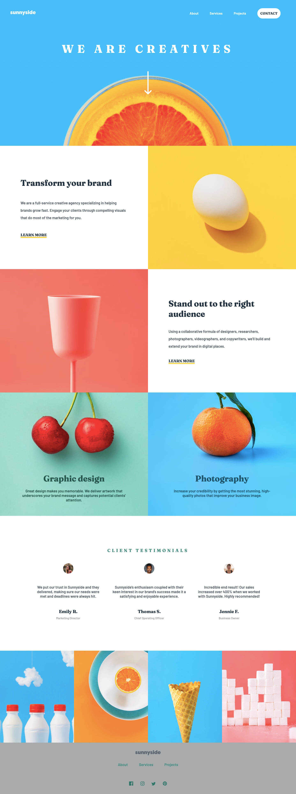

# Frontend Mentor - Sunnyside agency landing page solution

This is a solution to the [Sunnyside agency landing page challenge on Frontend Mentor](https://www.frontendmentor.io/challenges/sunnyside-agency-landing-page-7yVs3B6ef). Frontend Mentor challenges help you improve your coding skills by building realistic projects.

## Table of contents

-    [Overview](#overview)
     -    [The challenge](#the-challenge)
     -    [Screenshot](#screenshot)
     -    [Links](#links)
-    [My process](#my-process)
     -    [Built with](#built-with)
     -    [Continued development](#continued-development)
-    [Author](#author)

## Overview

### The challenge

Your challenge is to build out this landing page and get it looking as close to the design as possible.

This challenge focuses mostly on HTML & CSS. There's a tiny bit of JS included for the mobile navigation toggle. But you could also choose to do this without JS!

Users should be able to:

-    View the optimal layout for the site depending on their device's screen size
-    See hover states for all interactive elements on the page

### Screenshot

### Links

-    Solution URL: [Solution](https://github.com/esdra00/sunny-agency-landing-page.git)
-    Live Site URL: [Live Site](https://esdra00.github.io/sunny-agency-landing-page/)

## My process

### Built with

-    Semantic HTML5 markup
-    Flexbox
-    CSS Grid

### Continued development

Improve page responsivness and add ARIA elements.

## Author

-    Website - [Add your name here](https://www.your-site.com)
-    Frontend Mentor - [@esdra00](https://www.frontendmentor.io/profile/esdra00)
-    Github - [@esdra00](https://github.com/esdra00)
